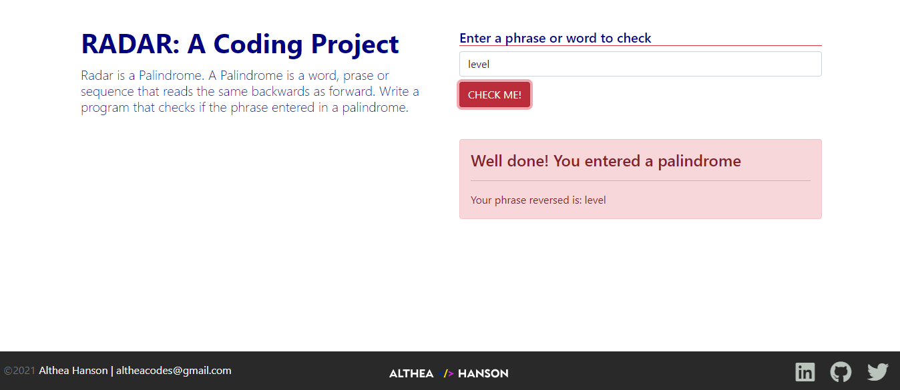

# Radar

## Description 
Radar is a Palindrome. A Palindrome is a word, phrase or sequence that reads the same backwards as forward. Write a program that checks if the phrase entered in a palindrome.

## User Story
As a user, I would like an application that checks if a word is the same when the letters are reversed.

## Installation

Clone Repository
- git clone https://github.com/Altheahanson/Radar.git

## Technology Used: 

- Bootstrap
- HTML 5
- CSS
- Javascript

## Deployed Application Link
https://radar-a-javascript-project.netlify.app
## Images
- 

## License
- This project is govern under the General Public v3.0 License

## Copyright
   (c) Copyright 2022 Althea Hanson 

